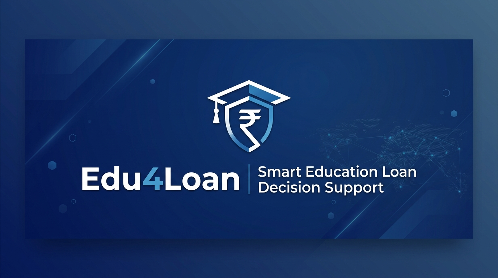
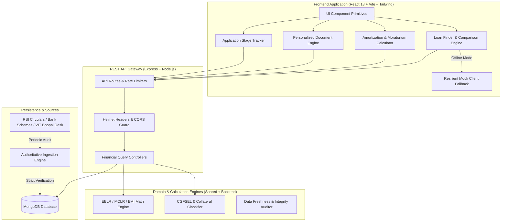

<div align="center">



# Edu4Loan

### Smart Education Loan Guidance & Decision-Support Platform for VIT Bhopal Students

<p align="center">
  <a href="#disclaimer--regulatory-boundary"></a>
  <a href="#core-principles"></a>
  <a href="#real-world-issues-students-face"></a>
  <a href="#automated-testing-matrix"></a>
  <a href="#project-architecture"></a>
  <a href="LICENSE"></a>
</p>

</div>

---

## Real-World Issues Students Face

Navigating education loans in India is often fraught with administrative hurdles, confusing financial jargon, and miscommunication between universities and bank branches. For students admitted to VIT Bhopal University (Kothri Kalan, Sehore, MP), these friction points cause critical delays during fee payment deadlines:

### 1. The Home Branch vs. Campus Branch Runaround
- **The Issue**: Students visit their hometown bank branch and are told, *"Go apply where your university is located."* When they reach the campus branch in Sehore, they are told, *"You must apply at the branch nearest to your parents permanent residence because they are the co-borrowers."*
- **Impact**: Weeks wasted shuttling between branches while college semester payment deadlines expire.

### 2. The Hidden Margin Money Shock
- **The Issue**: Families assume an approved loan of INR 15 Lakhs means the bank pays 100% of all expenses. Later, they discover the 5% to 15% margin money clause for loans above INR 4 Lakhs.
- **Impact**: Families are forced to arrange INR 75,000 to INR 2,25,000 in immediate cash before the bank releases the first disbursement cheque.

### 3. The Moratorium Interest Illusion
- **The Issue**: Many students believe repayment only starts after graduation and that no interest accrues while studying. In reality, simple or compound interest starts accumulating from Day 1 of disbursement.
- **Impact**: On a 4-year B.Tech loan of INR 12 Lakhs at 10.5% interest, unpaid interest during moratorium can add INR 3,50,000 to INR 4,80,000 to the principal before the student even lands their first job.

### 4. Unwarranted Collateral Demands Under INR 7.5 Lakhs
- **The Issue**: Branch officers often demand ancestral land papers, house deeds, or fixed deposits for loans under INR 7.5 Lakhs.
- **Impact**: Students from non-propertied backgrounds are discouraged or turn to high-interest private lenders, unaware that the central government CGFSEL guarantee scheme explicitly mandates zero collateral and zero third-party guarantee up to INR 7.5 Lakhs.

### 5. The Vidya Lakshmi & PM-Vidyalaxmi Blindspot
- **The Issue**: Students apply on the Vidya Lakshmi Portal (CELFS) but select the wrong branch IFSC code or fail to submit the physical acknowledgement receipt to the branch manager. Furthermore, many eligible students miss out on the November 2024 PM-Vidyalaxmi 3% interest subvention for family incomes up to INR 8 Lakhs.
- **Impact**: Applications sit in pending queues indefinitely with no updates or tracking.

### 6. Institutional Document Mismatches at VIT Bhopal
- **The Issue**: Banks require specific document titles (e.g., "Bonafide Student Certificate", "Estimated Cost of Study", "Approved Hostel Schedule"). Submitting generic university receipts leads to immediate file rejection by bank loan vetting cells (RACPC).
- **Impact**: Students repeatedly queue at the VIT Bhopal Finance and Student Welfare desks to re-issue paperwork in formats acceptable to SBI, PNB, or Canara Bank.

### 7. Co-Borrower Credit Score Surprises
- **The Issue**: In India, parents are mandatory co-borrowers. A forgotten overdue utility bill, minor credit card settlement, or low CIBIL score (<685) of the co-borrower triggers automatic algorithmic rejection by bank loan processing systems.
- **Impact**: Sudden rejection at the final verification stage with no prior warning.

---

## How Edu4Loan Solves These Problems

| Student Pain Point | How Edu4Loan Solves It | Module |
| :--- | :--- | :--- |
| **Branch Runaround** | Direct directory of verified VIT Bhopal nodal desks, RACPC hubs, and branch manager escalation contacts. | Module 11, 12 |
| **Margin Money Shock** | Explicit margin breakdown calculator showing exact student contribution vs. bank funding upfront. | Module 02, 06 |
| **Moratorium Misconception** | Month-by-month moratorium visualization showing simple vs. compound interest accrual and full amortization curves. | Module 05, 06 |
| **Unlawful Collateral Demands** | Clear collateral decision tree citing RBI and CGFSEL guarantee limits (zero collateral <= INR 7.5L). | Module 07, 15 |
| **Portal Application Confusion** | Step-by-step interactive walkthrough for Vidya Lakshmi registration and PM-Vidyalaxmi 2024 eligibility checks. | Module 09, 10 |
| **Paperwork Format Rejections** | Dynamic personalized document builder tailored to student degree, loan amount, and co-borrower profession. | Module 08, 14 |
| **Application Blindspots** | Self-service 5-stage application milestone tracker with bank meeting notes and follow-up logging. | Module 16, 17 |

---

## Project Architecture

Edu4Loan is engineered as an enterprise-grade TypeScript monorepo with clean separation between financial domain contracts, query engines, and presentation layers.



### Architectural Highlights

1. **Shared Domain Layer (`/shared`)**
   - Single source of truth for bank, scheme, document, and loan calculation types.
   - Eliminates contract drift between backend validation and frontend forms.
   - Enforces CGFSEL collateral rules and margin thresholds as shared constants.

2. **Calculation & Financial Query Engine (`/backend/src/services`)**
   - Precise amortization math accounting for moratorium periods (course duration + 1 year or 6 months).
   - Differentiates simple interest servicing during moratorium from compound accumulation.
   - Safe upsert logic preventing duplicate bank records and tracking verification timestamps.

3. **Data Quality & Audit Daemon (`/backend/src/scripts`)**
   - Automated health checks verifying data completeness, valid URLs, and expiration dates.
   - Isolated demo seeding (`isDemo: true`) allowing risk-free sandbox testing without contaminating production collections.

4. **Resilient Frontend Architecture (`/frontend/src`)**
   - Dual-mode API client: transparently serves live backend REST data or seamless offline mock fixtures if disconnected.
   - Zero-ranking design system: strictly sorts by factual criteria (rates, limits, margins) with zero subjective scorecards.
   - Interactive data visualizations with Recharts for repayment curves and interest burdens.

---

## Monorepo Layout

```
edu4loan/
├── ARCHITECTURE.md          # Full architectural blueprint and system models
├── PROJECT_PROGRESS.md      # Phase-by-phase implementation record (Phases 0-12)
├── API.md                   # REST API contracts, endpoints, and error formats
├── assets/
│   └── banner.jpg           # Slim platform header banner (1376x420)
├── shared/                  # Shared domain contracts & regulatory constants
│   ├── types/               # Bank, Scheme, Document, Application, Calculator types
│   └── constants/           # CGFSEL thresholds, document taxonomy, PSL limits
├── backend/                 # Node.js + Express REST API + MongoDB
│   ├── src/
│   │   ├── config/          # Environment configuration and database connection
│   │   ├── models/          # Mongoose schemas with indexing and verification tags
│   │   ├── controllers/     # Financial query controllers and search endpoints
│   │   ├── services/        # EMI calculation, audit logging, data safeguards
│   │   ├── routes/          # Express route definitions with rate-limiting
│   │   ├── seed/            # Authoritative production and demo datasets
│   │   └── scripts/         # Production seed runners and data quality auditor
│   └── tests/               # 58 automated backend tests across Phases 2, 3, 4
└── frontend/                # React 18 + TypeScript + Vite + Tailwind CSS
    ├── src/
    │   ├── api/             # Typed API client with graceful offline fallback
    │   ├── components/      # Accessible UI primitives (Button, Card, Badge, Modal, Input)
    │   ├── layout/          # Navbar, Footer, Mobile Drawer, Layout container
    │   ├── pages/           # 12 page views implementing the 22 modules
    │   ├── context/         # Student Application Context with local persistence
    │   └── utils/           # Financial formatting and amortization math
    └── test/                # 98 automated frontend tests across Phases 7-12
```

---

## 22 Core Modules Directory

| # | Module Name | Core Student Capability | Phase |
| :--- | :--- | :--- | :--- |
| **01** | **Home & Overview** | Value proposition, quick finder, scheme highlights, and legal disclaimers. | Phase 5 |
| **02** | **Student Loan Finder** | Multi-factor query engine filtering by degree, fees, collateral, and income. | Phase 6 |
| **03** | **Bank Database** | Filterable directory of public, private, and premier banks with verified tags. | Phase 6 |
| **04** | **Comparison Matrix** | Side-by-side comparison of 2 to 4 schemes across rates, margins, and fees. | Phase 6 |
| **05** | **Interest Rate Education** | Explainer on Repo rate, EBLR, MCLR, spread, and moratorium interest. | Phase 7 |
| **06** | **EMI Calculator** | Moratorium-aware amortization tables with interactive Recharts curves. | Phase 7 |
| **07** | **Collateral Explainer** | Guide to CGFSEL collateral-free limits (<= INR 7.5L) and tangible security. | Phase 8 |
| **08** | **Document Checklist** | Comprehensive dossier preparation guide across all 5 verification categories. | Phase 8 |
| **09** | **Vidya Lakshmi Guide** | Step-by-step walkthrough for CELFS application form and branch routing. | Phase 9 |
| **10** | **PM-Vidyalaxmi Guide** | 2024 scheme guidelines, NIRF criteria, and 3% interest subvention rules. | Phase 9 |
| **11** | **VIT Bhopal Loan Guide** | Campus branch details, fee structures, bonafide letters, and hostel inclusions. | Phase 9 |
| **12** | **Bank Directory** | Branch contacts, RACPC hubs, and education loan nodal desks. | Phase 6 |
| **13** | **Scheme Details** | Deep profile for individual schemes with primary circular references. | Phase 6 |
| **14** | **Personalized Documents**| Custom dynamic checklist based on loan quantum and co-borrower profession. | Phase 8 |
| **15** | **Eligibility Explainer** | Clear walkthrough of CIBIL score thresholds, debt ratios, and margin money. | Phase 12 |
| **16** | **Application Tracking** | Student stage tracker with milestone progression and interaction logging. | Phase 10 |
| **17** | **Student Dashboard** | Central dashboard with saved schemes, active loan, and document readiness. | Phase 10 |
| **18** | **Admin Dashboard** | Operations portal for monitoring data freshness, audit logs, and metrics. | Phase 11 |
| **19** | **Source Verification** | Data provenance auditor tracking timestamps, official URLs, and circulars. | Phase 11 |
| **20** | **Interactive FAQ** | Searchable knowledge base answering 20+ verified loan questions. | Phase 12 |
| **21** | **Global Search** | Instant multi-entity search across banks, schemes, guides, and documents. | Phase 5 |
| **22** | **Legal Framework** | Persistent disclaimer notices, data privacy, and regulatory boundaries. | Phase 5 |

---

## Automated Testing Matrix

Edu4Loan enforces strict quality standards with 156 automated passing tests:

```
Test Verification Summary: 156 / 156 Passed (100%)

Backend Suites (58 Passing Tests):
- Phase 2 Backend Foundation:               13 / 13 tests passed
- Phase 3 Data Ingestion & Seed Engine:     15 / 15 tests passed
- Phase 4 REST API & Financial Query:       30 / 30 tests passed

Frontend Suites (98 Passing Tests):
- Phase 7 Interest Rate & EMI Calculator:   22 / 22 tests passed
- Phase 8 Collateral & Document Engine:     20 / 20 tests passed
- Phase 9 Government & VIT Guides:          14 / 14 tests passed
- Phase 10 Student Dashboard & Tracker:     15 / 15 tests passed
- Phase 11 Admin Dashboard & Sources:       14 / 14 tests passed
- Phase 12 Eligibility & FAQ Knowledge:     13 / 13 tests passed
```

---

## Quick Start & Local Development

### 1. Prerequisites
- Node.js (v18.0.0 or higher)
- npm (v9.0.0 or higher)
- MongoDB (local daemon or Atlas cluster)

### 2. Backend Setup
```bash
cd backend
npm install

# Run automated tests (58 passing tests)
npm test            # Phase 2 Foundation suite
npm run test:phase3 # Phase 3 Seed Engine suite
npm run test:phase4 # Phase 4 REST API suite

# Seed authoritative production financial data
npm run seed:production

# Seed supplemental taxonomies
npm run seed:documents   # Official document taxonomy
npm run seed:government  # PM-Vidyalaxmi, Vidya Lakshmi, CSIS

# Data Quality & Audit Report
npm run data:quality     # Health check across all bank rates & circulars

# Build & Run Server
npm run build
npm start
```
The REST API starts at `http://localhost:5000`.

### 3. Frontend Setup
```bash
cd frontend
npm install

# Run automated test suites (98 passing tests)
npm test

# Build production bundle
npm run build

# Start Vite development server
npm run dev
```
The web client opens at `http://localhost:5173`.

---

## Disclaimer & Regulatory Boundary

Edu4Loan is an educational decision-support platform. It is not an authorized lender, loan broker, NBFC, or financial intermediary. The platform does not issue loans, sanction credit, or make loan guarantees. 

All interest rates, loan terms, and documentation requirements shown are compiled from publicly available circulars and official university guidelines for educational planning. Final loan sanction, interest rates, margin money requirements, and disbursement schedules are decided solely by the respective lending bank after their independent credit and legal assessment.

---

## License

This project is licensed under the MIT License. See [LICENSE](LICENSE) for details.
